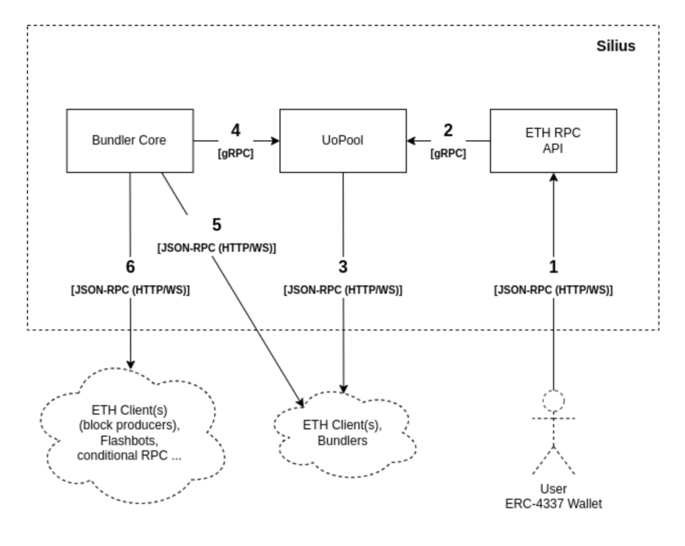
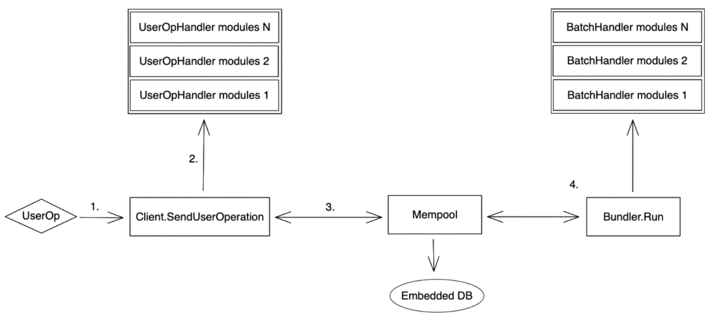
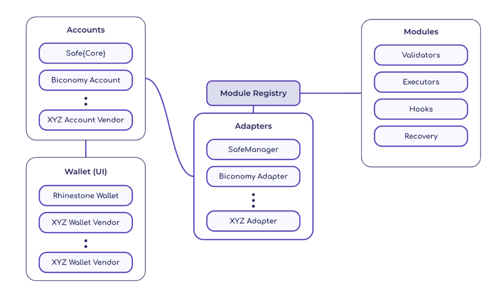

# 账户抽象赛道研究

# 概述

近日ERC-4337账户抽象基金公布了获得基金资助的18个项目，让账户抽象又一次进入了大家的视野。传统的EOA账户由于其在安全性，可定制化，便捷性和可拓展性等方面的不足，一直被人认为是阻挡大众进入区块链世界的一个门槛。EIP-4337提案在2021-09-29由Vitalik Buterin , Yoav Weiss , Dror Tirosh , Shahaf Nacson, Alex Forshtat, Kristof Gazso 和 Tjaden Hess 共同提出，至今已经过去两年，现在这个赛道已经有很多项目，不过大部分都还在早期阶段，还没有一个像是MetaMask一样杀手级别的项目出现。

ERC-4337的一些名词定义：

- UserOperation - 描述代表用户发送的事务的结构。为了避免混淆，它没有被命名为“交易”。
与交易一样，它包含“sender”、“to”、“calldata”、“maxFeePerGas”、“maxPriorityFee”、“signature”、“nonce”
与交易不同，其中“signature”字段的使用不是由协议定义的，而是由每个帐户实现定义的
- Sender - 发送用户操作的账户合约。
- EntryPoint - 执行 UserOperations 的单例合约。Bundlers/Clients将支持的EntryPoint列入白名单。
- Bundler - 一个节点（块构建器），可以处理 UserOperations，创建有效的 EntryPoint.handleOps() 事务，并在其仍然有效时将其添加到块中。
- Aggregator - 受账户信任的辅助合约，用于验证聚合签名。Bundlers/Clients将受支持的Aggregator 列入白名单。

账户抽象的组件大概可以分为五类：Bundler, SDK, EntryPoint , Paymaster 和 SmartContract Account。其中Bundler 类似于节点的功能，对外提供RPC服务，接收UserOperation交易，并将交易验证打包后发往EntryPoint合约执行；SDK 面向开发者，用来生成交易，发送交易到Bundler 等；EntryPoint 是所有UserOperation交易的执行入口合约，EntryPoint 中会校验UserOperation的有效性，计算交易Gas，扣除Gas以及最终调用账户合约执行交易等操作；Paymaster 相当于一个存款合约，用户可以预先存款到 Paymaster，并在后面的交易中指定 Paymaster 来代付Gas；SmartContract Account 为用户的账户合约，里面会负责校验并执行从EntryPoint发来的交易，同时账户合约也是最灵活的合约，用户可以在遵循接口标准的前提下添加定制化的功能。

下面主要按照Bundler，SDK，一体化钱包，模块化钱包和零知识证明钱包进行类讨论相关的项目，最后再聊聊和ERC-4337相关的一些提案。

# 赛道分类

## Bundler

由于ERC-4337的定义了一个叫做`UserOperations`的交易数据结构，其和传统的由EOA钱包签署的交易是不兼容的，这就导致原来的节点内存池在不进行代码逻辑修改的情况下无法接收和验证该交易类型。为了不改变原来节点的交易模型和处理流程，ERC-4337引入了`Bundler`的概念，`Bundler`是一个能接收`UserOperations` 并进行验证和打包的节点。由此可知Bundler的重要行，所以很多老牌节点服务商已经在布局Bundler服务，同时也有很多新的项目开始专注于进行Bundler的开发，势必要在这个新赛道上分一杯羹。

### Skandha Bundler

Skandha 由 Etherspot 团队开发， 是一个完全符合ERC-4337标准的生产级Bundler，使用Typescript构建。Skandha 专注于对交易的Gas进行优化，它通过智能地将单个交易分组到捆绑包中来实现这一点，然后将捆绑包作为单个单元进行处理。通过将交易捆绑在一起，与单独执行每笔交易相比，Skandha减少了总Gas费用。

Skandha的一个关键特性是它能够处理多种交易类型，比如简单的转账、智能合约交互，甚至是批处理交易。这种灵活性允许开发人员有效地管理复杂的交易场景并优化他们的Gas使用。

此外，Skandha还提供了交易排序和优先级管理等高级功能。它允许开发人员指定交易执行的顺序，并分配优先级级别，以确保及时处理关键交易。

Skandha提供了两种不同的运行模式，Public和Private。Public版本与其他Bundler一样，显示所有公开验证的交易。Private版本可以选择对外隐藏白名单上的交易和钱包。

**Links:** [Website](https://bit.ly/43VN5TD) | [Dev Docs](https://etherspot.fyi/?utm_source=ef_blog&utm_medium=article&utm_campaign=ef_grant)

### Silius

Silius 是一个用Rust开发的Bundler，目前还在开发过程中，还有很多功能像P2P、签名聚合等都还未实现。Silius受到模块化以太坊节点实现方案[Erigon](https://erigon.substack.com/p/architecture-of-erigon-separable)的启发，将Bundler设计成多个模块，每个模块都能单独启动和运行。



各个步骤的解释如下：

1.用户将来自兼容ERC-4337的钱包的`UserOperation`作为JSON-RPC请求发送到RPC API端点。他们还可以检索支持的Entry Point，Chain Id，估计用户操作Gas等。
2.ETH RPC API连接到UoPool，以向内存池添加新的`UserOperation`，检索支持的Entry Point，Chain Id，估计用户操作Gas等。
3.UoPool连接到ETH客户端以检索有关以太坊账户的信息(余额，股权/存款信息等)。ETH客户端应该启用调试名称空间，因为调用debug_traceCall是模拟用户操作所必需的。UoPool还连接到P2P网络中的其他Bundler，广播接收到的`UserOperation`并检索其他用户操作。
4.Bundler Core组件通过gRPC从UoPool检索用户操作，以创建`UserOperation` Bundles。
5.Bundler Core连接到ETH客户端获取有关账户和以太坊网络的信息。
6.Bundler Core组件将构建的bundle(普通的以太坊交易)发送到ETH客户端，一个区块生产者，或者将它们发送到Flashbots服务。在生产环境中，由于提前运行，不应该将bundle直接插入到公共tx池中。

**Links:** [Website](https://zerodev.app/) | [Twitter](https://twitter.com/zerodev_app)

### Stackup

Stackup 团队是一个ERC-4337 基础设施开发团队，目前实现了一个用Go实现的模块化ERC-4337 Bundler。

Stackup Bundler 体系结构如下：



1. UserOperation 通过任意传输层（例如 HTTP 或 P2P）到达客户端。
2. 客户端验证 UserOperation：
    
    2.1 检查 EntryPoint 是否受支持。
    2.2 UseOperation 具有正确的架构。
    2.3 内存池中没有重复项，或者它有足够高的气体来替换它。
    2.4 通过中间件堆栈发送 UserOperation 进行处理。
    
3. UserOperation 被添加到内存池中。内存池还将其保存在嵌入式数据库中以进行持久化。
4. 在单独的 goroutine 中，捆绑器将运行重复的过程：
    
    4.1 查询内存池中的新批次。
    4.2 通过中间件堆栈发送批次进行处理。
    4.3 从内存池中删除已处理的 UserOperations。
    

Links: [Website](https://www.stackup.sh/) | [Twitter](https://twitter.com/stackup_fi)

## SDK

### Blocto SDK

Blocto SDK旨在帮助开发人员以最小的努力构建出色的dapp。Blocto SDK 支持JavaScript SDK，Andriod SDK，iOS SDK 以及Unity SDK，并且支持大部分EVM兼容链。Blocto SDK 还与市面上大部分受欢迎的SDK进行了集成，例如 Web3.js，thirdweb 和 wagmi 等。

现在 Blocto SDK已经通过改造的 Web3.js 集成ERC-4337特定的RPC方法，例如 `sendUserOperation`、`estimateUserOperationGas`、`getUserOperationByHash`、`getUserOperationReceipt`和`supportedEntryPoints`。通过这样做，开发人员可以使用这些方法专注于他们真正关心的事情。例如，如果dApp想要提供更好的用户体验，则可以将调用方式从`sendTransaction` 更改 为`sendUserOperation`，只要钱包提供商支持此功能即可。

### Biconomy

Biconomy Modular SDK 是一款专为去中心化应用程序 (dApp) 设计的综合软件开发套件。它建立在 ERC4337 解决方案之上，提供了从用户入门到持续参与的广泛解决方案，从而增强了 dApp 中的整体用户体验。通过利用模块化，该 SDK 提供了增强的定制、安全性和功能。

Biconomy SDK 以非托管方式为您的 dApp 带来与区块链无关、类似 web2 的体验。以下是目前启用的功能：

- 轻松的用户入门：通过社交登录、帐户创建和恢复选项简化新用户的入门流程，将 web2 用户无缝集成到您的 dApp 中。
- Fiat On Ramp：允许您的用户在您的 dApp 中轻松可靠地购买或出售加密货币，促进传统资产和基于区块链的资产之间的过渡
- 无 Gas 交易：为用户交互提供 Gas 费用，使其像 Web2 交易一样简单，并改善整体用户体验。
- 用ERC20代币支付Gas费：用户可以使用钱包中的任何ERC20资产来支付Gas费，提供灵活性和便利性。
- 自定义交易捆绑：使开发人员能够构建交易批处理方法，允许用户在单个交易中执行多个操作，甚至跨多个链。例如，用户可以在同一笔交易中批准和存款，而无需更改 dApp 智能合约中的任何内容。

Biconomy SDK 要做的其实是类似ERC4337领域的Alchemy，ERC4337的基础设施服务。开发者通过调用SDK的函数可以快速创建一个ERC4337钱包，打包ERC4337交易并起发送到Bundler。此外Biconomy SDK还提供Paymaster 和 Bundler 服务，通过Biconomy Dashboard用户可以自己创建一个Paymaster 并进行白名单等管理，同时提供了 Bundler 的 API 服务。

Link: [Website](https://www.biconomy.io/) | [Twitter](https://twitter.com/biconomy)

## 一体化钱包

### UniPass

UniPass Wallet 是一个基于 [UniPass Contract](https://docs.wallet.unipass.id/zh/contract/intro) 开发的低门槛的支持邮件社交恢复的智能合约钱包解决方案。通过 UniPass Wallet，开发者可以在产品内提供流畅的免私钥、免 gas 的用户体验，从而快速地吸引海量的 Web2 用户。

UniPass的特色：

- 免私钥-用户使用邮箱和密码注册、登录账户，无需接触助记词、私钥。
- 抗审查-用户完全掌握账户的控制权，无需依赖第三方服务。
- 免 Gas-支持使用任意链的任意资产支付交易手续费。
- 邮件恢复-用户可以通过守护者邮箱向链上合约提交账户恢复邮件，找回账户。
- 隐私保护-在链上采用零知识证明技术实现邮件脱敏验证，保护用户的邮箱隐私。
- 多平台-用户端覆盖网页版、移动端、浏览器插件全平台，支持多种调用方式。
- 支持多链-可以兼容所有 EVM 链，并且保证多链地址一致。

UniPass Wallet 是一个对用户和开发者都是足够友好的钱包。对用户来说，目前支持直接使用邮箱和谷歌账户进行注册和登录，当密钥损毁或丢失时，用户可以通过选定作为守护者的多位互联网用户，通过向链上合约提交账户恢复邮件的方式，找回他们的账户，实现零门槛的社交恢复。对开发者来说，提供了Web，Android，iOS 等多个平台的 SDK 支持，使得开发者无论在移动端还是网页端都能快速的介入UnicPass。

**Links**: [Website](https://www.unipass.id/) | [Twitter](https://twitter.com/UniPassWallet)

### Ambire

Ambire 是一个通过DKIM进行自托管的电子邮件/密码认证的钱包，也就是说可以通过邮件和客户端密码的方式进行结合验证。

Ambire 智能帐户为多个签名者提供选项。支持两种类型的签名者。第一个是电子邮件/密码签名者，第二个是 EOA，例如硬件钱包、浏览器扩展（Web3 钱包）等。当使用电子邮件/密码签名者时，Ambire 会在后台创建一个 2/2 多重签名，其中一个密钥位于您的设备上并使用密码进行加密，而另一个则负责验证电子邮件验证码并存储在后端 HSM 上。这两把钥匙都是控制帐户所必需的，但一把就足以触发时间锁定恢复程序。

Ambre 钱包拥有以下特性：

- 硬件钱包支持：Trezor、Ledger 和 Grid+ Lattice1
- 通过 WalletConnect 连接任何 dApp
- 自动交易费用管理
- 用稳定币支付交易费用
- 自动显示所有资产的仪表板：代币、NFT 和 DeFi 协议存款
- 多个 EVM 网络：Ethereum、Polygon、BSC、Avalanche 等等
- 在不影响Ambire自我管理特性的情况下注册一个电子邮件/密码
- 通过我们的入口合作伙伴用信用卡或银行转账存入FIAT
- 事务批处理:在一个事务中执行多个操作的能力
- 自动领先/三明治保护通过Flashbots
- 多个签名者(密钥)可以用来控制同一个账户:例如一个硬件钱包和一个软件钱包;可以很容易地启用或禁用这些功能

**Links:** [Website](https://www.ambire.com/wallet) | [Twitter](https://twitter.com/AmbireWallet)

## 零知识证明钱包

### IoTeX

IoTeX是一个将智能设备连接到区块链Dapps的web3平台，其团队的两名高级研究员开发了一个基于零知识证明的账户抽象钱包。钱包使用zkSNARK来确认帐户访问:如果用户拥有正确的密码，他们可以使用证明程序生成有效的证明来解锁帐户。然后链上智能合约验证此证明以验证交易。

简单看一下合约之中的校验逻辑正是用了零知识证明的校验，钱包合约中存储了用户密码的哈希passHash用来参与校验：

```jsx
// https://github.com/iotexproject/zkp-wallet-contracts/blob/main/src/ZKPassAccount.sol
function _validateSignature(
        UserOperation calldata userOp,
        bytes32 userOpHash
    ) internal virtual override returns (uint256 validationData) {
        if (!verifyProof(userOp.signature, uint256(userOpHash))) {
            return SIG_VALIDATION_FAILED;
        }
        return 0;
    }

    function verifyProof(bytes calldata _proof, uint256 _opHash) public view returns (bool) {
        uint256[2] memory a;
        uint256[2][2] memory b;
        uint256[2] memory c;
        {
            (
                uint256 proof0,
                uint256 proof1,
                uint256 proof2,
                uint256 proof3,
                uint256 proof4,
                uint256 proof5,
                uint256 proof6,
                uint256 proof7
            ) = abi.decode(_proof[:256], (uint256, uint256, uint256, uint256, uint256, uint256, uint256, uint256));
            a = [proof0, proof1];
            b = [[proof2, proof3], [proof4, proof5]];
            c = [proof6, proof7];
        }
        uint256 opProof = uint256(bytes32(_proof[256:]));

        _opHash %= SNARK_SCALAR_FIELD;

        uint256[4] memory input = [passHash, opProof, getNonce(), _opHash];
        return _verifier.verifyProof(a, b, c, input);
    }
```

项目目前还有很多功能待完善，像邮件验证功能等。钱包未来愿景包括在账户抽象钱包的多个方面整合zkp，包括通过web2身份验证进行钱包操作，使用web2社交媒体状态进行社交恢复，以及使用流行的web2支付渠道初始化零余额钱包。

1. Smart contracts - https://github.com/iotexproject/zkp-wallet-contracts
2. ZKP circuits - https://github.com/iotexproject/zkp-wallet-circuits

**Links:** [Website](https://iotex.io/) | [Twitter](https://twitter.com/iotex_io)

## 模块化钱包

### ZeroDev ***Kernel***

ZeroDev Kernel 的设计理念类似于Linux Kernel, 就好比Linux Kernel可以被应用于Android、树莓派等操作系统一样，ZeroDev Kernel旨在构建一个最小的智能合约账户，这个智能合约账户可以很方便的被拓展，这样 Kernel 的设计者可以专注于 Kernel 的设计，其他开发人员只用在 Kernel 之上去进行拓展而不需要从头开始设计和开发整个AA钱包。

具体来说，内核包括以下我们认为对任何AA钱包必不可少的基本功能:

- 兼容ERC-4337
- 用ERC-1271验证签名
- 批处理事务
- 委托调用(Delegating calls)

此外，ZeroDev Kernel 为开发人员构建了一个插件框架，以便在内核之上添加功能，而无需升级帐户本身。Kernel的一个主要目标是培育一个繁荣的插件生态系统，Alchemy的开发人员最近起草了ERC-6900，题为“模块化智能合约账户和插件”（Modular Smart Contract Accounts and Plugins.）。EIP的目标是在智能合约账户(例如Kernel)和插件之间定义一个公共接口。ZeroDev Kernel团队声称到目前为止，Kernel是他们所知道的最接近ERC-6900的实现，一旦最终完成，ZeroDev Kerne团队将使Kernel与[ERC-6900](https://eips.ethereum.org/EIPS/eip-6900)完全兼容。所以为Kernel开发的插件不是只能在Kernel上工作。

大部分智能合约钱包会使用代理合约的方式来部署，这样后续可以对钱包合约进行升级而不用改变钱包合约的地址，但是在实际中对逻辑合约的升级需要遵守一些规则，最主要的原因是如果升级后的逻辑合约的存储设计不合理，会很容易导致新的升级合约的变量存储地址覆盖掉升级前的变量的存储地址，或者导致升级后存储地址的冲突。这就对开发人员有较高的要求。ZeroDev Kernel在设计时考虑了迁移。为此，Kernel使用钻石存储(*[diamond storage](https://dev.to/mudgen/how-diamond-storage-works-90e)*)——一种确保一个钱包的数据存储不会与另一个钱包的数据存储发生冲突的技术。因此，从内核迁移到内核上构建的钱包是非常安全的。

**Links:** [Website](https://zerodev.app/) | [Twitter](https://twitter.com/zerodev_app)

### Rhinestone

Rhinestone 是一个账户抽象模块化平台，Rhinestone 协议由几个关键组件组成，分别是Accounts、Modules、Module Registry 和 Adapters。其主要目标是成为一个可靠的中立中间件层，解决用户安全、帐户可移植性和帐户可扩展性问题。其架构设计如下：



其中：

- Account 是用作用户账户的智能合约（“smart accounts”）。这些智能帐户启用了模块。该协议与帐户无关，其目标是与所有模块化智能帐户实现进行互操作。
- Modules 是扩展用户帐户功能的智能合约。模块分为四种不同的类型: 验证器(Validators)、执行器(Executors)、挂钩(Hooks)和恢复(recovery)，模块将兼容[ERC-6900](https://eips.ethereum.org/EIPS/eip-6900)。
- Module Registry是模块市场的基础层。它的主要功能是执行标准和安全保证。重要的是，模块注册表是无所有者、无需许可且免费的，为开发人员、审计人员、供应商和用户在模块市场中提供了最大的灵活性。
- Adapters 是帐户和模块注册表之间存在的通信层。该适配器允许供应商或用户指定他们的安全态势并确保模块满足一组规定的安全规则和准则(使用[ERC-7484](https://ethereum-magicians.org/t/erc-7484-registry-adapters-for-smart-accounts/15434)标准)。

Rhinestone 为开发者提供了一整套框架和标准，开发者只需要专注于开发特定的模块功能，以实现定制化的需求。

**Links:** [Website](https://www.rhinestone.wtf/) | [Twitter](https://twitter.com/rhinestonewtf) | [Github](https://github.com/rhinestonewtf)

## 相关提案

### ERC-6900: Modular Smart Contract Accounts and Plugins

ERC-6900 提案标准化了智能合约账户和账户插件，它们是允许智能合约账户内可组合逻辑的智能合约接口。该提案符合 ERC-4337，受到ERC-2535 的启发，定义更新和查询模块化功能实现的接口 。

该标准定义了一个模块化的智能合约帐户，能够支持所有符合标准的插件。这使得用户的数据具有更大的可移植性，并且插件开发人员不必选择支持特定的帐户实现。这些插件可以包含执行逻辑(execution logic)、验证方案(validation schemes)和挂钩(hooks)。验证方案定义了智能合约帐户将批准代表其采取的操作的情况，而挂钩则允许执行前和执行后控制。

**Link**: [提案网址](https://eips.ethereum.org/EIPS/eip-6900)

### ERC-7484: Registry Adapters for Smart Accounts

该提案提出了一个用于模块化智能帐户的标准化注册表适配器(registry adapter)。该适配器允许帐户通过证明注册表查询和验证有关模块的安全证明。适配器负责查询注册表并正确处理返回值。

该提案仍处于草案阶段，可能会根据社区的意见进行重大更改。

**Link**: [提案网址](https://ethereum-magicians.org/t/erc-7484-registry-adapters-for-smart-accounts/15434)

### ERC-4972: Name-Owned Account

该提案建议通过将每个人类可读身份链接到可由名称(Name)身份所有者控制的单个智能合约帐户来扩展名称服务（例如 ENS）的功能。

一个NOA（Name-Owned Account） 有：

- ERC-137 定义的人类可读名称；和
- 自有账户（NOA），这是一个智能合约账户，其地址由名称衍生而来；和
- 可以部署和操作所拥有帐户的名称的所有者。

下图说明了 NOA、名称节点(Name Node)和名称所有者(Name Owner)之间的关系，所有权由名称服务保证。


**Link**: [提案网址](https://eips.ethereum.org/EIPS/eip-4972)

### EIP-7377: Migration Transaction

该EIP提出了这样的机制：提供一种嵌入协议中的机制，将 EOA 迁移到智能合约。

EOA账户经过那么多年的发展，目前有大量资产存放在 EOA 账户中。如果用户无法轻易将 EOA 账户中的所有资产手动迁移到新的智能合约地址，这势必阻碍ERC-4377的发展。

EIP-7377 提出了一种特殊的交易类型，普通用户只需要发起这种交易，就可以将账号里的资产迁移到智能合约钱包。

**Link**: [提案网址](https://eips.ethereum.org/EIPS/eip-7377)

# 总结

ERC-4337 一直被认为是以太坊钱包的未来，不过最近火热的Telegram钱包也让人们看到了另一种可能，毕竟目前区块链用户也就4亿，而Telegram每月有将近8亿的月活用户。好在这两者并不是竞争的关系，如果像Telegram， Discord，X等Web2公司能将用户吸引到Web3，那何尝不是一件好事。账户抽象目前正在蓬勃发展，不过要满足易操作性，安全性，可拓展性等要求还需要一段时间。从当前的一些项目来看，能通过邮箱等Web2的方式进行登录似乎已经是各个ERC-4337钱包首要支持的基本功能。同时模块化的账户合约架构逐渐成为一些主流被接受，毕竟这也符合当前区块链架构的发展路径。而结合零知识证明来增加用户的隐私，也是一种未来钱包发展的一个重要方向。

# 参考链接
https://erc4337.mirror.xyz/hRn_41cef8oKn44ZncN9pXvY3VID6LZOtpLlktXYtmA